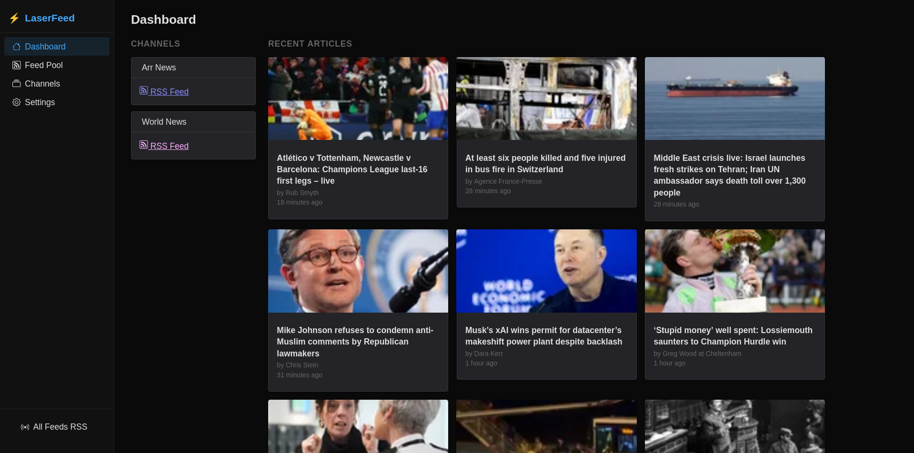
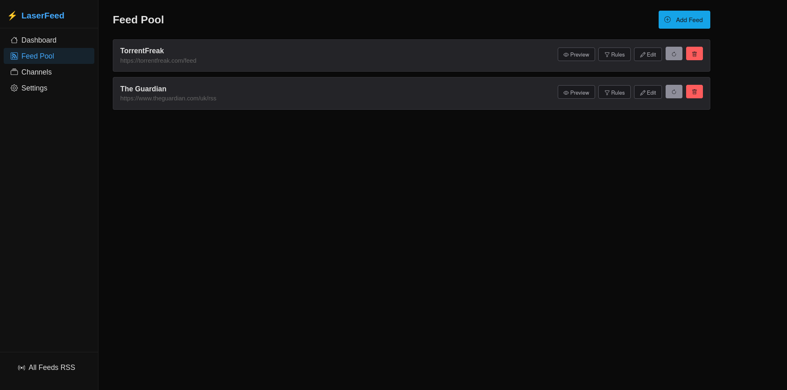
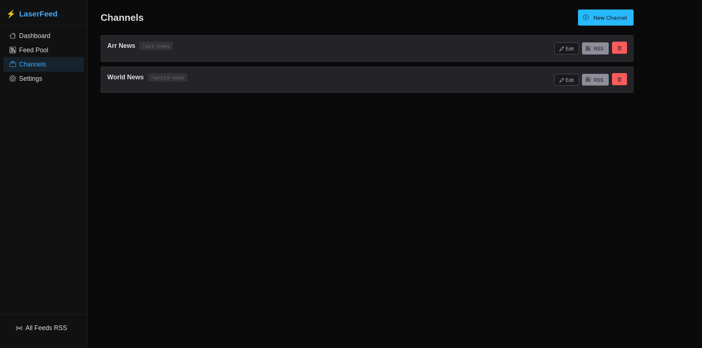

# LaserFeed

LaserFeed is a self-hosted RSS/Atom feed aggregator. Add feed sources to a shared pool, configure per-feed content scraping, thumbnail policies, and keyword filters, then compose **Channels** that each produce their own Atom output. Point any RSS reader at a channel URL and get a clean, curated feed.

---

## Features

- **Feed pool** — add any RSS/Atom source; configure poll interval, user-agent override
- **Full-content scraping** — fetch the actual article page and extract content via Readability (automatic) or CSS/XPath selector; reader-view sanitisation strips ads and nav
- **Page & content strip selectors** — two-level CSS selectors to remove unwanted elements: page-level (ads, navs, banners) and content-level (scoped within the article)
- **Cookie support** — paste a raw `Cookie` header to bypass cookie walls on paywalled sites
- **Filter rules** — whitelist/blacklist by title, URL, description, or content with substring or glob patterns (`*`, `?`)
- **Channels** — named aggregates that combine any subset of feeds into a single Atom feed at `/channels/:slug/feed.rss`
- **Thumbnails** — automatic extraction from feed media tags; configurable fallback (extract from content, placeholder URL, or per-article identicon)
- **Content retention** — configurable max age for scraped content; manual purge and re-scrape controls
- **Import / Export** — round-trip full configuration (feeds, filters, channels) via a documented JSON backup
- **Dark theme** — built with Shoelace web components on an OLED-black palette

---

## Screenshots

<table>
  <tr>
    <td></td>
    <td></td>
  </tr>
  <tr>
    <td></td>
    <td></td>
  </tr>
</table>

[See all screenshots →](docs/screenshots/)

---

## Tech stack

| Layer | Technology |
|---|---|
| Language | Go |
| Web framework | Echo |
| Templating | templ (SSR) |
| Frontend | HTMX + Shoelace |
| Database | PostgreSQL |
| Content extraction | go-readability + goquery |
| Sanitisation | bluemonday |
| Migrations | golang-migrate |

---

## Quick start (development)

The development stack uses [air](https://github.com/air-verse/air) for live reload — every `.go` or `.templ` save rebuilds and restarts the server automatically. No local Go toolchain is required; everything runs inside Docker.

**Prerequisites:** Docker (with Compose support).

```bash
git clone https://github.com/xblackbytesx/laserfeed.git
cd laserfeed
make dev
```

The first build pulls base images, installs npm dependencies (Shoelace + HTMX), and starts the app. Once you see `starting server addr=:8080` in the logs, open:

```
http://localhost:8080
```

The database persists in a named Docker volume (`laserfeed_pgdata_dev`) between restarts.

All dev values are hard-coded in `docker/docker-compose-dev.yml` — nothing to configure.

### Useful commands

```bash
make dev      # start (or restart) the dev stack
make down     # stop all containers
make reset    # full teardown + clean restart (wipes the dev database)
make logs     # follow app logs
```

---

## Self-hosting (production)

### 1. Prerequisites

- A Linux host with Docker
- A reverse proxy (Traefik, Caddy, nginx, ...) on a Docker network named `proxy`
- A host directory for persistent data (database)

The production Compose file (`docker/docker-compose.yml`) joins an **external** Docker network called `proxy` so your reverse proxy can reach the app container. If you use a different network name, edit the `networks` section in `docker/docker-compose.yml`.

### 2. Create host directories

```bash
# Adjust the base path to wherever you keep Docker data
mkdir -p /opt/docker/laserfeed/database
```

### 3. Create the environment file

Copy `.env.example` to `.env` next to the Compose file and fill in real values. At minimum you need `DOCKER_ROOT`, `DB_PASSWORD`, `CSRF_AUTH_KEY`, and `APP_BASE_URL`. See the [environment variable reference](#environment-variable-reference) below for the full list.

```bash
cp .env.example .env
# Generate secrets:
openssl rand -base64 32   # run once for CSRF_AUTH_KEY
```

### 4. Start the stack

```bash
make up
# or directly:
docker compose -f docker/docker-compose.yml up --build -d
```

The app container builds from source, runs database migrations automatically, then listens on port `8080`. Point your reverse proxy at the `laserfeed-app` container on that port.

### 5. Verify

```bash
curl https://feeds.example.com/health
# {"status":"ok"}
```

---

## Updating

```bash
git pull
make up   # rebuilds image and restarts; migrations run automatically
```

The app runs database migrations automatically on every startup, so schema upgrades are handled for you. The database volume is not touched by a rebuild.

---

## Feed output URLs

| URL | Description |
|---|---|
| `/channels/:slug/feed.rss` | Atom feed for a specific channel |
| `/feed.rss` | All articles from all feeds (unfiltered by channel) |

Both endpoints return `Content-Type: application/atom+xml` and can be added directly to any RSS reader.

---

## Scraping tips

### Choosing an extraction method

Each feed has an **extraction method** setting that controls how full-content scraping works:

| Method | When to use |
|---|---|
| **Readability** (default) | Works well for most sites. Automatically finds and extracts the main article content — no configuration needed. |
| **CSS / XPath selector** | Use when Readability picks up too much or too little. You provide a selector that targets the exact content element. |

Start with Readability. Switch to selector mode only if the automatic extraction isn't giving good results for a particular site.

### Strip selectors

Strip selectors let you remove unwanted elements (ads, sharing buttons, related-article blocks) from the scraped content. There are two levels:

**Page strip selectors** — run against the full HTML page before extraction. Use these for site-wide junk that sits outside the article area:

```
nav.site-header
.ad-container
#cookie-banner
footer
```

**Content strip selectors** — scoped to within the article. In Readability mode they are limited by the optional "strip selector scope" field; in selector mode they run on the extracted fragment. Use these for elements inside the article body:

```
h1
.sharing-buttons
ul:first-of-type
.author-bio
```

In selector mode, both lists are combined and applied to the extracted content fragment.

### Finding the right CSS selector

Open the target article in your browser, right-click the main article body, Inspect, then copy the selector. Common patterns:

```
article
.article-body
.post-content
main
[role=main]
```

### XPath selectors

Use XPath (in selector mode) when the content isn't cleanly addressable with CSS, e.g.:

```xpath
//article[@class='story-body']
//div[contains(@class,'post-content')]
```

### Cookie walls (e.g. regional news sites)

1. Open the site in your browser and log in or accept cookies
2. Open DevTools, Network, reload a page, click any request to the site, Request Headers, copy the `Cookie` value
3. Paste it into the "Cookie header" field on the feed edit page
4. Save, then trigger a re-scrape

Cookies are stored as plain text in the database. Don't use a shared LaserFeed instance for sites where your session cookie grants access to paid content.

---

## Backups

Data lives in the `pgdata` Docker volume. To dump the database:

```bash
docker compose exec db pg_dump -U laserfeed laserfeed > backup.sql
```

To restore:

```bash
docker compose exec -T db psql -U laserfeed laserfeed < backup.sql
```

You can also use the built-in **Settings > Export** to download a JSON backup of all feeds, filters, and channels, and **Settings > Import** to restore it.

---

## Environment variable reference

| Variable | Required | Default | Description |
|---|---|---|---|
| `DOCKER_ROOT` | Yes | — | Host path for persistent data (e.g. `/opt/docker`) |
| `DB_PASSWORD` | Yes | — | PostgreSQL password |
| `CSRF_AUTH_KEY` | Yes | — | CSRF signing key, minimum 32 characters |
| `APP_BASE_URL` | No | `http://localhost:8080` | Public URL, used in Atom feed self-links |
| `PORT` | No | `8080` | Port the HTTP server binds to |
| `SECURE_COOKIES` | No | `true` | Set `false` when running over plain HTTP (dev only) |

---

## Project structure

```
laserfeed/
├── cmd/laserfeed/      # main entry point, route registration
├── docker/             # Dockerfiles, Compose files, air config
├── internal/
│   ├── atom/           # Atom XML feed generation
│   ├── config/         # environment variable loading
│   ├── db/             # connection pool, migration runner
│   │   └── migrations/
│   ├── domain/         # core types (Feed, Article, Channel, FilterRule, Settings)
│   ├── filter/         # whitelist/blacklist filter engine
│   ├── handler/        # HTTP handlers (feeds, channels, settings, backup)
│   ├── middleware/      # CSRF, request logger
│   ├── poller/         # per-feed poll goroutines, rescrape manager
│   ├── repository/     # database access (FeedStore, ArticleStore, ChannelStore…)
│   └── scraper/        # HTTP fetch, Readability, CSS/XPath extraction, sanitisation
└── web/
    ├── static/         # CSS, JS, vendor assets (Shoelace, HTMX)
    └── templates/      # templ components (layouts, pages)
```

---

## License

GPL-2.0
